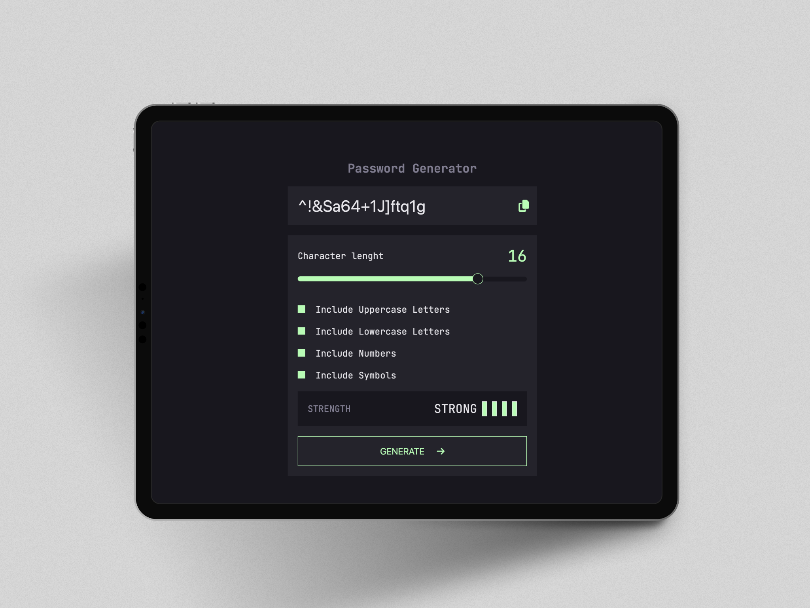

# Password Generator

This project is a challenge from [Frontend Mentor](https://www.frontendmentor.io/challenges/password-generator-app-Mr8CLycqjh). On this project you would be able to generate a random password with the parameters that you set. You'll need to have at least one parameter set for generate a password and also you'll be able to copy the password clicking the clipboard icon.

## 🚀 Deployment

https://johanh0.github.io/Password-Generator/

## 🛠 Technologies

- HTML
- CSS
- JavaScript

## Author

- [@Johanh0](https://www.github.com/johanh0)

## Support or contact

For support or if you wish contact me please, email me to [johanherrera20000@gmail.com](mailto:johanherrera20000@gmail.com).
